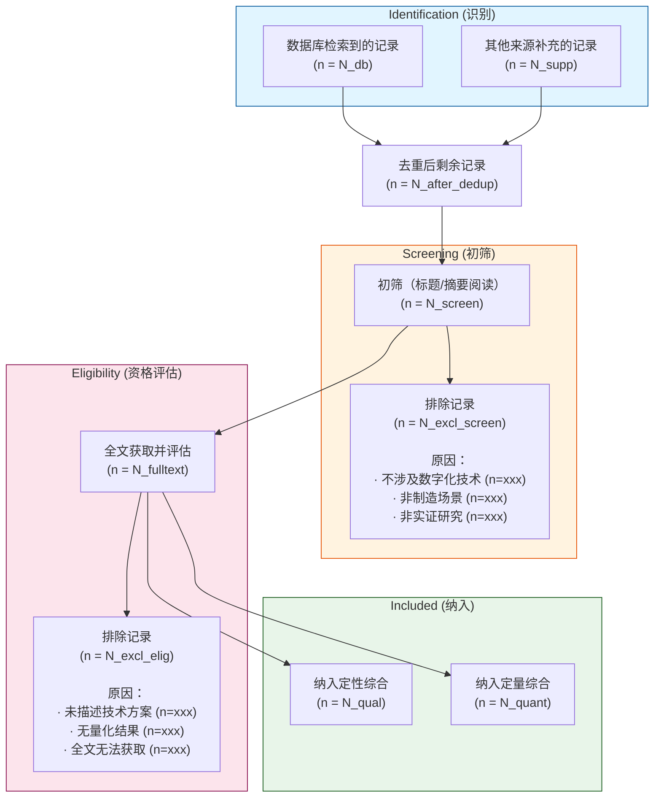
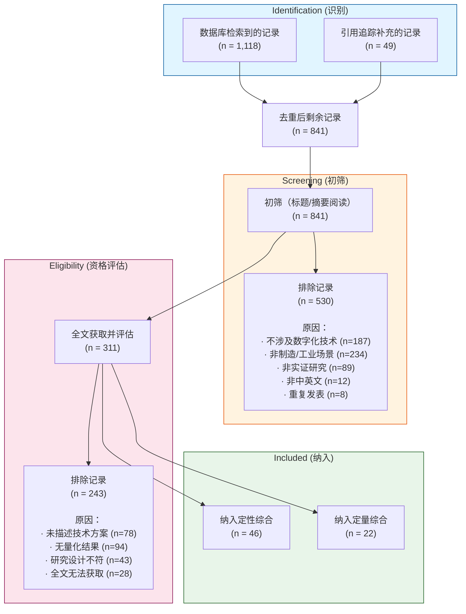

# PRISMA 2020 流程图生成指南 / PRISMA 2020 Flow Diagram Guide

> PRISMA (Preferred Reporting Items for Systematic Reviews and Meta-Analyses) 2020 标准——系统综述/范围综述的文献筛选流程透明化工具

---

## 什么是 PRISMA 流程图

PRISMA 流程图是系统综述中记录文献筛选过程的标准可视化工具。它回答了一个核心问题：

> *"你最初找到了多少篇文献？经过哪些筛选步骤？最后纳入了多少篇？每一步分别排除了多少？每条排除记录对应什么理由？"*

**为什么重要**：没有 PRISMA 流程图的文献综述，审稿人的第一反应是——"你的筛选过程不可重复，结论可能是选择偏差的结果。"

---

## 四阶段流程

PRISMA 2020 将文献筛选分为四个阶段：

```
Identification → Screening → Eligibility → Included
   (识别)         (初筛)       (资格评估)     (纳入)
```

### 阶段 1：Identification（识别）

**做了什么**：从各数据库和补充来源检索到所有可能相关的记录。

**记录内容**：

| 来源 | 检索到的记录数 |
|------|--------------|
| 数据库 1（如 Web of Science） | n₁ = ? |
| 数据库 2（如 Scopus） | n₂ = ? |
| 数据库 3（如 IEEE Xplore） | n₃ = ? |
| 合计（去重前） | N_total_before = ? |
| 去重后 | N_after_dedup = ? |
| 补充来源（引用追踪、灰色文献等） | n_supp = ? |

**虚构示例**：

```markdown
研究问题：数字化技术在工业制造质量管理中的应用效果（虚构）

### Identification 阶段记录

| 来源 | 检索到的记录数 |
|------|--------------|
| Web of Science | n₁ = 347 |
| Scopus | n₂ = 412 |
| IEEE Xplore | n₃ = 156 |
| CNKI (中国知网) | n₄ = 203 |
| **合计（去重前）** | **N = 1,118** |
| 去重（EndNote 自动 + 手动） | 移除 326 篇重复 |
| **去重后** | **N = 792** |
| 正向引用追踪 | 新增 18 篇 |
| 反向引用追踪 | 新增 31 篇 |
| **进入 Screening 阶段** | **N = 841** |
```

### 阶段 2：Screening（初筛）

**做了什么**：阅读标题和摘要，排除明显不相关的记录。

**排除标准**（可操作化）：

| 标准编号 | 描述 | 虚构示例 |
|---------|------|---------|
| S1 | 不涉及数字化/信息化技术 | 传统手工质量管理方法的描述 |
| S2 | 不涉及制造/工业场景 | 纯医疗、金融或教育场景 |
| S3 | 非实证研究（纯评论/社论/观点文章） | 行业评论、编者按 |
| S4 | 非中英文文献 | 其他语言但无翻译资源 |
| S5 | 重复发表 | 同一研究的不同版本 |

```markdown
### Screening 阶段记录

| 排除原因 | 排除数量 |
|----------|---------|
| S1：不涉及数字化技术 | 187 |
| S2：非制造/工业场景 | 234 |
| S3：非实证研究 | 89 |
| S4：非中英文 | 12 |
| S5：重复发表 | 8 |
| **合计排除** | **530** |
| **进入 Eligibility 阶段** | **N = 311** |
```

### 阶段 3：Eligibility（资格评估）

**做了什么**：获取全文，逐篇仔细阅读，评估是否满足纳入标准。

**纳入标准**（可操作化）：

| 标准编号 | 描述 |
|---------|------|
| I1 | 明确描述了使用的数字化技术或系统 |
| I2 | 报告了至少一个可量化的质量指标（或管理指标） |
| I3 | 研究设计为实验/准实验/案例研究/调查 |
| I4 | 全文可获取 |

```markdown
### Eligibility 阶段记录

| 排除原因 | 排除数量 |
|----------|---------|
| I1 不满足：未明确描述技术方案 | 78 |
| I2 不满足：无量化结果 | 94 |
| I3 不满足：研究设计不符合 | 43 |
| I4 不满足：全文无法获取 | 28 |
| **合计排除** | **243** |
| **进入 Included 阶段** | **N = 68** |
```

### 阶段 4：Included（纳入）

**做了什么**：确认最终纳入的文献集。

```markdown
### Included 阶段记录

| 类别 | 数量 |
|------|------|
| 纳入定量综合（如 meta-analysis） | n = 22 |
| 纳入定性综合（系统综述分析） | n = 46 |
| **最终纳入合计** | **N = 68** |

# 如果进行了 meta-analysis，还需要记录：
- 哪些文献被纳入 meta-analysis？为什么有些被排除（如异质性太高）？
```

---

## Mermaid 语法生成 PRISMA 流程图

以下提供可直接渲染的 Mermaid 流程图代码。替换其中的占位数字即可。

### 完整 Mermaid 模板

````markdown

````

### 虚构示例（填充数字后）

````markdown

````

### 渲染效果说明

将上述 Mermaid 代码块放入支持 Mermaid 的 Markdown 渲染器（如 GitHub、Notion、Typora、VS Code），即可自动渲染为四色阶段的流程图。

---

## PRISMA 2020 Checklist（摘要）

PRISMA 2020 除了流程图，还有一份 27 项的清单（checklist）。与流程记录最相关的 6 项：

| 条目 | 要求 | 在论文中的位置建议 |
|------|------|-------------------|
| #6 | 明确陈述研究的纳入/排除标准 | 方法 → 检索策略 |
| #7 | 详细描述所有检索的数据库、检索式、日期 | 方法 → 检索策略 |
| #8 | 报告每次数据库检索的完整策略（可放附录） | 附录 |
| #9 | 描述筛选过程（几人独立筛选？一致性如何？） | 方法 → 研究选择 |
| #16a | 描述筛选结果（PRISMA 流程图） | 结果 → 图 1 |
| #16b | 列举排除的文献及排除原因（至少列出关键排除） | 结果或附录 |

---

## 中英文论文的 PRISMA 陈述规范

### 中文论文中的表述

中文期刊论文中，PRISMA 流程图通常放在"研究方法"的"文献检索与筛选"部分：

```text
本研究依据 PRISMA 2020 声明 [引用] 进行文献筛选和报告。
文献检索于 2025 年 1 月进行，共检索 Web of Science、
Scopus、IEEE Xplore 和 CNKI 四个数据库。

初检获得 1,118 篇文献，经 EndNote X9 去重后剩余 841 篇。
两名研究者独立阅读标题和摘要进行初筛，排除 530 篇
（排除原因见图 1）。对剩余 311 篇获取全文后精读，
依据纳入/排除标准进一步筛选，最终纳入 68 篇文献，
其中 22 篇纳入 Meta 分析。筛选流程见图 1。
```

### 英文论文中的表述

```text
This systematic review was conducted and reported in accordance
with the PRISMA 2020 statement [citation]. The literature search
was performed in January 2025 across four databases: Web of Science,
Scopus, IEEE Xplore, and CNKI.

After removing 326 duplicates from the initial 1,118 records,
841 records remained for title/abstract screening. Two reviewers
independently screened these records, resulting in 530 exclusions.
Full texts of the remaining 311 records were retrieved and assessed
for eligibility, yielding 68 studies for final inclusion (22 in
quantitative synthesis). The screening process is illustrated in Figure 1.
```

---

## 常见问题

### Q: 我的研究不是系统综述，需要 PRISMA 流程图吗？

**A:** 如果是范围综述 (Scoping Review) → 使用 PRISMA-ScR 扩展版。如果是传统文献综述 (Narrative Review) → 不需要完整的 PRISMA 流程图，但建议在方法论部分简要描述检索策略和筛选标准以增加透明度。

### Q: 去重工具推荐？

**A:**
- **EndNote**：老牌文献管理工具，去重精准但收费
- **Zotero**：免费开源，配合 "Duplicate Items" 插件效果好
- **Rayyan**：专为系统综述设计的免费在线工具，协同筛选功能强
- **ASReview**：AI 辅助筛选，适用于大规模文献集

### Q: 筛选者间一致性如何报告？

**A:** 报告 Cohen's Kappa（≥0.61 为实质性一致，≥0.81 为近乎完美一致）或简单的"一致率%"。不一致的条目应通过讨论达成共识或请第三位评审者裁决。

---

## 相关文件

- [检索策略构建](search-strategy.md) — 如何设计数据库检索式（PRISMA 流程图的上游输入）
- [文献矩阵](literature-matrix.md) — 纳入文献的系统化分析（PRISMA 流程图的下游输出）
- [Gap 识别](gap-identification.md) — 基于纳入文献识别研究空白
